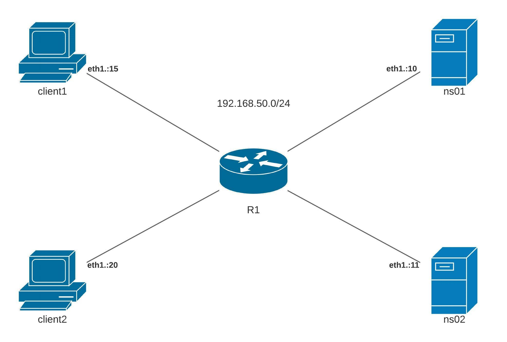

## Стенд для настройки и обслуживание DNS.

Цель:

- взять стенд https://github.com/erlong15/vagrant-bind, добавить сервер client2

завести в зоне dns.lab имена:
- web1 - смотрит на клиент1
- web2 смотрит на клиент2

завести еще одну зону newdns.lab:
- завести в ней запись
- www - смотрит на обоих клиентов

настроить split-dns
- клиент1 - видит обе зоны, но в зоне dns.lab только web1
- клиент2 видит только dns.lab

*) настроить все без выключения selinux



### Реализация.

#### 1. Установка и запуск DNS master на сервере ns01
Установим необходимые пакеты для поднятие DNS сервера `bind`, `bind-utils`.
```
[root@ns01 ~]# yum install -y bind bind-utils
```
Настроим конфигурационный файл `/etc/named.conf`.
```
[root@ns01 ~]# vi /etc/named.conf
```
```
options {

    // network 
	listen-on port 53 { 192.168.50.10; };
	listen-on-v6 port 53 { ::1; };

    // data
	directory 	"/var/named";
	dump-file 	"/var/named/data/cache_dump.db";
	statistics-file "/var/named/data/named_stats.txt";
	memstatistics-file "/var/named/data/named_mem_stats.txt";

    // server
	recursion yes;
	allow-query     { 192.168.50.0/24; };
    allow-transfer { 192.168.50.11; };
    
    // dnssec
	dnssec-enable yes;
	dnssec-validation yes;

    // others
	bindkeys-file "/etc/named.iscdlv.key";
	managed-keys-directory "/var/named/dynamic";
	pid-file "/run/named/named.pid";
	session-keyfile "/run/named/session.key";
};

logging {
    channel default_debug {
        file "data/named.run";
        severity dynamic;
    };
};

// RNDC Control for client
key "rndc-key" {
    algorithm hmac-md5;
    secret "GrtiE9kz16GK+OKKU/qJvQ==";
};
controls {
    inet 192.168.50.10 allow { 192.168.50.15; } keys { "rndc-key"; }; 
};

acl "client1" {
    192.168.50.15/32; // client1
};

acl "client2" {
    192.168.50.20/32; // client2
};

// ZONE TRANSFER WITH TSIG
//include "/var/named/keys/named.zonetransfer.key"; 

key "zonetransfer.key" {
    algorithm hmac-md5;
    secret "GrtiE9kz16GK+OKKU/qJvQ==";
};
server 192.168.50.11 {
    keys { "zonetransfer.key"; };
};

view "client1" {
    match-clients { "client1"; };

    // root zone
    zone "." IN {
        type hint;
        file "named.ca";
    };

    // zones like localhost
    include "/etc/named.rfc1912.zones";

    // roots DNSKEY
    include "/etc/named.root.key";

    // dns.lab zone
    zone "dns.lab" {
        type master;
        file "master/named.client1-dns.lab";
        allow-transfer { key "zonetransfer.key"; };
    };

    // newdns.lab zone
    zone "newdns.lab" {
        type master;
        file "master/named.newdns.lab";
        allow-transfer { key "zonetransfer.key"; };
    };

    // dns.lab zone reverse
    zone "50.168.192.in-addr.arpa" {
        type master;
        file "master/named.client1-dns.lab.rev";
        allow-transfer { key "zonetransfer.key"; };
    };

    // ddns.lab zone
    zone "ddns.lab" {
        type master;
        file "dynamic/named.ddns.lab";
        allow-transfer { key "zonetransfer.key"; };
        allow-update { key "zonetransfer.key"; };
    };
};

view "client2" {
    match-clients { "client2"; };

    // root zone
    zone "." IN {
        type hint;
        file "named.ca";
    };

    // zones like localhost
    include "/etc/named.rfc1912.zones";

    // roots DNSKEY
    include "/etc/named.root.key";

    // dns.lab zone
    zone "dns.lab" {
        type master;
        file "master/named.client2-dns.lab";
        allow-transfer { key "zonetransfer.key"; };
    };

    // dns.lab zone reverse
    zone "50.168.192.in-addr.arpa" {
        type master;
        file "master/named.client2-dns.lab.rev";
        allow-transfer { key "zonetransfer.key"; };
    };
};

view "default" {
    match-clients { "any"; };

    // root zone
    zone "." IN {
        type hint;
        file "named.ca";
    };

    // zones like localhost
    include "/etc/named.rfc1912.zones";

    // roots DNSKEY
    include "/etc/named.root.key";

    // dns.lab zone
    zone "dns.lab" {
        type master;
        file "master/named.dns.lab";
        allow-transfer { key "zonetransfer.key"; };
    };

    // newdns.lab zone
    zone "newdns.lab" {
        type master;
        file "master/named.newdns.lab";
        allow-transfer { key "zonetransfer.key"; };
    };

    // dns.lab zone reverse
    zone "50.168.192.in-addr.arpa" {
        type master;
        file "master/named.dns.lab.rev";
        allow-transfer { key "zonetransfer.key"; };
    };

    // ddns.lab zone
    zone "ddns.lab" {
        type master;
        file "dynamic/named.ddns.lab";
        allow-transfer { key "zonetransfer.key"; };
        allow-update { key "zonetransfer.key"; };
    };
};
```
Создадим каталоги для DNS сервера `ns01`.
```
[root@ns01 ~]# mkdir -p /var/named/master
[root@ns01 ~]# mkdir -p /var/named/keys
```
Создадим зоны для DNS сервера `ns01`.
- `dns.lab`
- `newdns.lab`
- `ddns.lab`

```

```
```

```


Создадим обратную зону для DNS сервера `ns01`.
- `dns.lab`

#### 2. Настройка DNS slave на сервере ns02


#### 1. Настройка DNS master на сервере ns01

